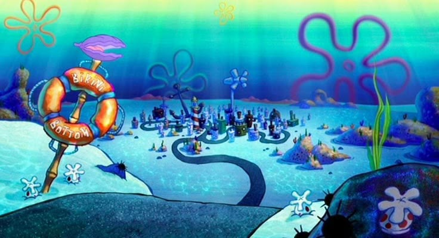

# 🧽 Bikini Bottom Database 🐚

Welcome to the **Bikini Bottom Database** – a relational database inspired by the wacky and wonderful underwater world of **SpongeBob SquarePants**! This project is a playful representation of iconic locations and characters from the **SpongeBob SquarePants Movie**, structured with MySQL tables and relationships. Perfect for database practice or just having fun with your favorite cartoon!

## 🧍‍♂️ Residents & Structures

### 🌊 Notable Owners
- **SpongeBob SquarePants** – Enthusiastic fry cook and eternal optimist.
- **Squidward Tentacles** – Grumpy clarinetist with a passion for peace and quiet.
- **Patrick Star** – Unemployed starfish and best friend to SpongeBob.
- **Mr. Krabs** – Money-loving owner of the Krusty Krab.
- **Plankton** – Tiny but ambitious owner of the Chum Bucket.

### 🏡 Iconic Buildings
- **SpongeBob's Pineapple House** – The fruitiest house under the sea!
- **Squidward's House** – A moai-inspired stone home, perfect for solitude.
- **Patrick's Rock** – Literally a rock, but it works!
- **Krusty Krab** – Home of the Krabby Patty and SpongeBob’s workplace.
- **Chum Bucket** – Plankton’s not-so-popular fast-food joint.

---

## 💾 Installation 
To run the portfolio locally:

1. Clone this repository
2. Head to the index.html
3. Double click it or open it on whichever browser you want! It's responsive.

## History

Created 02/04/2025

## Credits

Created by Keith Lie

## License

MIT - See license file for more information